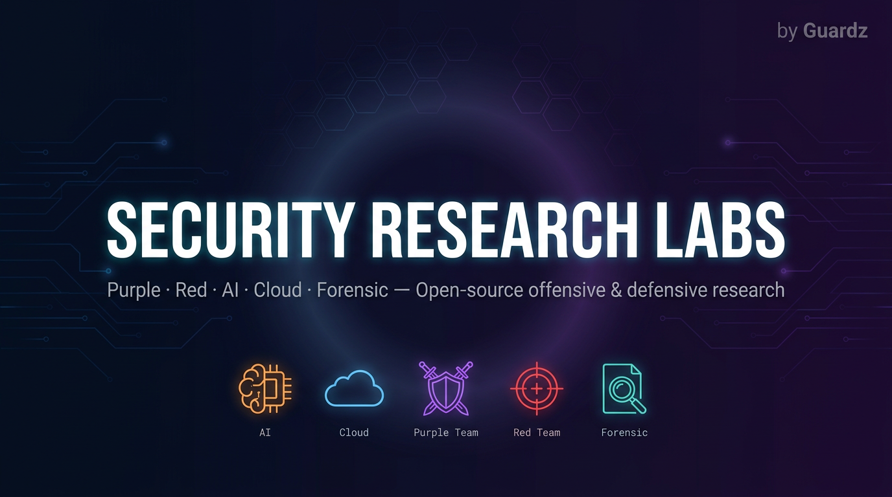

<p align="center">
  <a href="https://github.com/guardzcom/security-research-labs">
    
  </a>
</p>

<!-- Project badges -->
<p align="center">
  <a href="https://github.com/guardzcom/security-research-labs/stargazers"></a>
  <a href="https://github.com/guardzcom/security-research-labs/network/members"></a>
  <a href="https://github.com/guardzcom/security-research-labs/releases"></a>
  <a href="LICENSE"></a>
</p>

<!-- Tech & health badges -->
<p align="center">
  
  
  
  <a href="https://github.com/guardzcom/security-research-labs/commits/main"></a>
  <a href="https://github.com/guardzcom/security-research-labs/graphs/contributors"></a>
  <a href="https://github.com/guardzcom/security-research-labs/issues"></a>
</p>

<!-- Category quick-links -->
<p align="center">
  <a href="AI-Cloud-Tools/"></a>
  <a href="Purple-Team-Emulation/"></a>
  <a href="CloudAdversary/M365/"></a>
  <a href="Threat-Intel/"></a>
  <a href="Research/"></a>
</p>

Security Research Labs is the official Guardz repo for open-source security tooling: config analyzers, Microsoft 365 / Entra recon scripts, purple-team detection emulations, and AI skill security. MIT-licensed; each tool lives in a **dedicated folder with its own README**.

---

## Featured tools

<table>
  <tr>
    <td width="50%" valign="top">
      <h3>🩸 EntraReaper</h3>
      <p><em>Autonomous red-team platform for Microsoft Entra ID.</em></p>
      <p>MCP server that wraps <strong>238 AADInternals cmdlets</strong> into <strong>65 purpose-built tools</strong> across 12 MITRE ATT&amp;CK phases, with 13 kill chains, OPSEC governance, evasion engine, and auto-reporting.</p>
      <p>
        <code>Python 3.11+</code> · <code>PowerShell 7</code> · <code>macOS / Linux</code><br/>
        <a href="AI-Cloud-Tools/M365-Tools/EntraReaper/"><strong>Explore →</strong></a>
      </p>
    </td>
    <td width="50%" valign="top">
      <h3>🔬 SkillScan</h3>
      <p><em>Scan AI skill files for malicious patterns.</em></p>
      <p>Detects prompt injection, malware delivery, code execution, suspicious URLs, and obfuscated content in AI skill definitions — local files or URLs. Ships with CLI, local server, and browser UI.</p>
      <p>
        <code>Python 3</code> · <code>CLI / Server / Web</code> · <code>No cloud required</code><br/>
        <a href="AI-Cloud-Tools/AI/skillscan/"><strong>Explore →</strong></a>
      </p>
    </td>
  </tr>
  <tr>
    <td width="50%" valign="top">
      <h3>🧠 OpenClaw Analyzer</h3>
      <p><em>Security configuration analyzer for OpenClaw deployments.</em></p>
      <p>Single-file web app with a <strong>68-point checklist</strong>, risk detection, and attack-path visualization. No server required — open the HTML in a browser.</p>
      <p>
        <code>Web</code> · <code>Zero install</code> · <code>Offline</code><br/>
        <a href="AI-Cloud-Tools/AI/OpenClaw-Analyzer/"><strong>Explore →</strong></a>
      </p>
    </td>
    <td width="50%" valign="top">
      <h3>🕸️ GraphRunner QuickStart</h3>
      <p><em>Cookbook for <a href="https://github.com/dafthack/GraphRunner">dafthack/GraphRunner</a>.</em></p>
      <p>One-file quick reference and runnable command set: auth, tenant recon, Conditional Access enumeration, mailbox / SharePoint / Teams search, and token utilities.</p>
      <p>
        <code>PowerShell 5.1+</code> · <code>Windows / macOS / Linux</code><br/>
        <a href="CloudAdversary/M365/graphrunner-quickstart/"><strong>Explore →</strong></a>
      </p>
    </td>
  </tr>
</table>

<p align="right"><sub>See <a href="#repository-layout">repository layout</a> for the full catalog.</sub></p>

---

## Quick Start

Clone and pick a tool — every folder ships with its own README.

```bash
git clone https://github.com/guardzcom/security-research-labs.git
cd security-research-labs
```

**Try SkillScan in 30 seconds** — no tenant, no auth, no cloud required:

```bash
cd AI-Cloud-Tools/AI/skillscan
python3 skillscan.py scan file path/to/skill.md
# or scan a whole folder
python3 skillscan.py scan dir ./skills/ --pattern "*.md"
# or a URL
python3 skillscan.py scan url https://example.com/skill
```

**Try OpenClaw Analyzer in 10 seconds** — zero install:

```bash
open AI-Cloud-Tools/AI/OpenClaw-Analyzer/openclaw-security-analyzer/openclaw-analyzer.html
```

**Run EntraReaper against a tenant you own / are authorized to test:**

```bash
cd AI-Cloud-Tools/M365-Tools/EntraReaper
bash install.sh                    # installs PowerShell 7, AADInternals, uv
uv run python server.py            # standalone
# or wire it into Claude Code as an MCP server:
claude mcp add entrareaper -- uv run --directory "$PWD" python server.py
```

> **Authorized use only.** Run these tools only against systems and tenants you **own** or have **explicit permission** to test. See [Security model](#security-model-important).

---

## Repository layout

| Category | Folder | Contents |
|----------|--------|----------|
| [](AI-Cloud-Tools/) | [AI-Cloud-Tools/](AI-Cloud-Tools/) | AI: OpenClaw Analyzer, SkillScan. M365-Tools: OAuth IOCs checker, [EntraReaper](AI-Cloud-Tools/M365-Tools/EntraReaper/) (MCP + AADInternals for authorized Entra ID red team). |
| [](Purple-Team-Emulation/) | [Purple-Team-Emulation/](Purple-Team-Emulation/) | Endpoint: certutil, EDR telemetry simulator, Office macro tampering, BloodHound emulation, Nmap scanning emulation. |
| [](CloudAdversary/M365/) | [CloudAdversary/M365/](CloudAdversary/M365/) | DeviceStrike, Entra ID Smart Lockout (Entra-ID-DOS), SPO Ext Recon, GraphRunner QuickStart. |
| [](Purple-Team-Emulation/GWS/) | [Purple-Team-Emulation/GWS/](Purple-Team-Emulation/GWS/) | Google Workspace security tools (placeholder). |
| [](Threat-Intel/) | [Threat-Intel/](Threat-Intel/) | IOCs, detection artifacts, threat intelligence. |
| [](Research/) | [Research/](Research/) | Research outputs, landscape studies, and reference materials (e.g. [M365 AiTM](Research/M365/AiTM/), [hybrid AD MFA gap](Research/M365/Dormant/)). |

---

## Who it's for

| Category | Audience | Use case |
|----------|----------|----------|
| [](#) | **Cloud Security** | Microsoft 365 and Google Workspace. |
| [](#) | **AI security** | Securing AI assistants and agents: config hardening, exposure detection, supply-chain and skill safety. |
| [](#) | **Purple team** | Hardening checks, config review, detection-oriented recon. |
| [](#) | **Red team** | Authorized recon, token flows, M365/cloud attack-surface mapping. |
| [](#) | **Forensic** | Evidence gathering, mailbox/SharePoint/Teams search patterns, audit trails. |

> **Authorized use only.** Use only on systems and tenants you **own** or have **explicit permission** to test.

---

## Security model (important)

> **Compliance & authorized use**
>
> - **Authorized use only.** These tools are for security research, authorized testing, and defensive operations. Use them only on systems and tenants you **own** or have **explicit permission** to test.
> - **No misuse.** Do not use this repo to gain unauthorized access, exfiltrate data, or violate laws or organizational policies. Misuse is your responsibility.
> - **Operational risk.** Recon and auth scripts can trigger alerts or rate limits. Coordinate with stakeholders and follow change management where required.
> - **Data handling.** Output may contain sensitive information. Handle and retain it according to your classification and retention policies.
>
> By using this repository you agree to use it in a lawful and authorized manner. See [SECURITY.md](SECURITY.md) for how to report vulnerabilities in the repo itself.

---

## Support & community

- **Bugs and features:** <a href="https://github.com/guardzcom/security-research-labs/issues" target="_blank" rel="noopener noreferrer">Open an issue</a>. Use the issue templates when possible.
- **Security vulnerabilities:** Do **not** report in public issues. See <a href="SECURITY.md" target="_blank" rel="noopener noreferrer">SECURITY.md</a> for private reporting.
- **Discussions:** Use <a href="https://github.com/guardzcom/security-research-labs/discussions" target="_blank" rel="noopener noreferrer">GitHub Discussions</a> for questions and ideas if enabled; otherwise open an issue.
- **Contributions:** Pull requests welcome. Read <a href="CONTRIBUTING.md" target="_blank" rel="noopener noreferrer">CONTRIBUTING.md</a> and <a href="CODE_OF_CONDUCT.md" target="_blank" rel="noopener noreferrer">CODE_OF_CONDUCT.md</a> first.

We do not provide formal SLAs or commercial support; we respond when we can.

---

## License

<a href="LICENSE" target="_blank" rel="noopener noreferrer">MIT License</a>. Subdirectories may contain their own license files; where present, they apply to that project.
